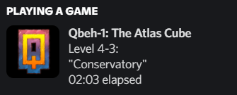

# Qbeh1-DiscordRPC
This is a mod for [Qbeh-1: The Atlas Cube](https://store.steampowered.com/app/252550/Qbeh1_The_Atlas_Cube/) which adds support for Discord Rich Presence, showing what level you are on, which level you are editing, etc.  
This mod requires [BepInEx 5](https://github.com/BepInEx/BepInEx/releases/tag/v5.4.21) to be installed on your Qbeh-1: The Atlas Cube.

You can download this mod at [Releases](https://github.com/KabanFriends/Qbeh1-DiscordRPC/releases) page.

## Preview

## Building
To compile this mod yourself, you must reference `Assembly-CSharp.dll` and `Assembly-CSharp-firstpass.dll` in Qbeh-1: The Atlas Cube game files.
